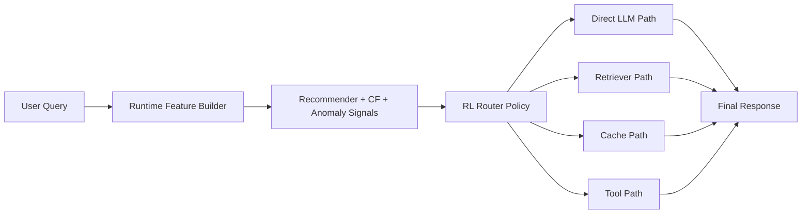

# 🧠 Intelligent AI Router
### A more complete end-to-end architecture for LLM routing, retrieval, cache, and tool selection

<p align="center">
  
  
  
  
  
</p>

## What changed in this version

The earlier version was a **research-style routing simulator**. It had learning components, but it did not really look like a full application.

This version upgrades the architecture so it behaves like a small but real AI system:

- **training pipeline** for offline routing policy learning
- **artifact export** for inference-time use
- **runtime router service**
- **local retriever**
- **local cache**
- **tool execution path**
- **direct LLM path stub**
- **CLI demo**
- **FastAPI app**

It is still a prototype, but now it looks much more like a deployable system.

---

## Problem

Modern AI applications should not send every request to the same path.

Depending on the query, the best route may be:

- a direct LLM response
- retrieval-augmented generation (RAG)
- a cache hit
- an external tool call

This project learns and executes that routing decision.

---

## Full architecture



### Inference flow

1. Query arrives
2. Cache is checked first
3. Runtime features are built
4. Recommender, collaborative filter, and anomaly features are computed
5. RL policy chooses a route
6. The selected backend executes
7. Response is returned and optionally cached

---

## Learning components

### Unsupervised learning
Used for:
- TF-IDF feature extraction
- KMeans clustering
- anomaly detection support

### Recommender system
Used for:
- nearest-neighbor action recommendation from similar historical queries
- confidence-aware routing hints

### Reinforcement learning
Used for:
- learning a final routing policy across direct LLM, retrieval, cache, and tool actions

---

## Runtime components

### 1. Router service
`src/router_service.py`

Loads saved artifacts and executes the full routing flow.

### 2. Retriever
`src/retriever.py`

Local TF-IDF retriever over a generated knowledge base.

### 3. Cache
`src/cache_store.py`

Simple local persistent cache with fuzzy query matching.

### 4. Tool executor
`src/tool_executor.py`

Supports arithmetic-style tool calls in the offline demo.

### 5. LLM backend stub
`src/llm_backend.py`

A local stand-in for the direct LLM path so the system works without external APIs.

### 6. FastAPI app
`src/app.py`

HTTP interface for serving the router.

### 7. CLI demo
`src/demo.py`

Quick way to test the router from the terminal.

---

## Project structure

```text
intelligent-ai-router-complete/
│
├── src/
│   ├── app.py
│   ├── cache_store.py
│   ├── collaborative_filter.py
│   ├── config.py
│   ├── data_loader.py
│   ├── demo.py
│   ├── environment.py
│   ├── evaluate.py
│   ├── feature_engineering.py
│   ├── knowledge_base.py
│   ├── llm_backend.py
│   ├── plot_results.py
│   ├── q_learning_agent.py
│   ├── recommender.py
│   ├── retriever.py
│   ├── router_service.py
│   ├── routing_oracle.py
│   ├── runtime_features.py
│   ├── tool_executor.py
│   ├── train.py
│   └── utils.py
│
├── data/
├── artifacts/
├── results/
├── figures/
├── requirements.txt
└── README.md
```

---

## Dataset

The project prefers the **AI2 ARC** dataset when internet access is available.

When offline, it falls back to a bundled ARC-like sample dataset so the whole package still runs.

That means:
- you can demo it locally with no external dependencies beyond Python packages
- you can re-train on the real dataset later for stronger claims

---

## How training works

Run:

```bash
python src/train.py
```

This will:
- load the dataset
- build text features and clusters
- train anomaly, recommender, collaborative filtering, and RL components
- generate plots and metrics
- export reusable artifacts into `artifacts/`
- build a local knowledge base and retriever

### Saved outputs

- `results/training_history.csv`
- `results/test_with_predictions.csv`
- `results/metrics.json`
- `figures/training_reward.png`
- `figures/rolling_reward.png`
- `figures/composite_comparison.png`
- serialized inference artifacts in `artifacts/`

---

## How inference works

### CLI demo

```bash
python src/demo.py --query "Which planet is known as the Red Planet?"
python src/demo.py --query "What is 12 * 7?"
```

### FastAPI

```bash
uvicorn src.app:app --reload
```

Then call:

- `GET /health`
- `POST /route`

Example body:

```json
{
  "query": "What is 12 * 7?"
}
```

---

## Why this architecture is stronger

Compared with the earlier version, this one adds the missing execution layer.

That makes it much better for GitHub and interviews because it now shows:

- offline training
- artifact management
- inference-time routing
- multiple execution backends
- API serving
- system decomposition beyond a notebook-style prototype

---

## Current limitations

This is still not a production system yet.

Important limitations:
- the direct LLM path is a local stub, not a real hosted foundation model
- the retriever is local TF-IDF, not a dense-vector production retriever
- the tool path currently focuses on arithmetic-style queries
- routing rewards are still modeled rather than measured from real online traffic
- the RL formulation is still simplified for a one-step decision problem

---

## Best next upgrades

If you want to make this genuinely interview-elite, the next improvements are:

1. replace the LLM stub with a real API-backed model
2. replace TF-IDF retrieval with dense embeddings + vector store
3. add more tools beyond calculator behavior
4. replace tabular Q-learning with a contextual bandit or DQN
5. add request logging and evaluation over live routes
6. add a small web UI

---

## Resume-ready description

> Built an end-to-end intelligent AI routing system combining unsupervised learning, nearest-neighbor recommendation, collaborative filtering, and reinforcement learning to choose between direct LLM response, retrieval, cache, and external tool execution; added a runtime router service, local retriever, cache layer, and API interface for deployable inference.

---

## Quick verdict

This version is no longer just a routing simulation.
It is now a **small end-to-end architecture** that you can train, package, and run locally.

That makes it much closer to the kind of project that looks strong on GitHub and in interviews.
